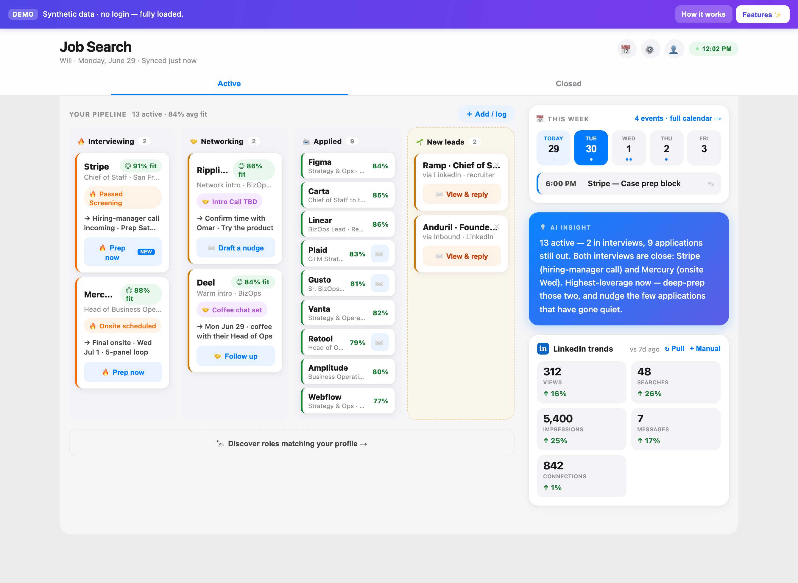
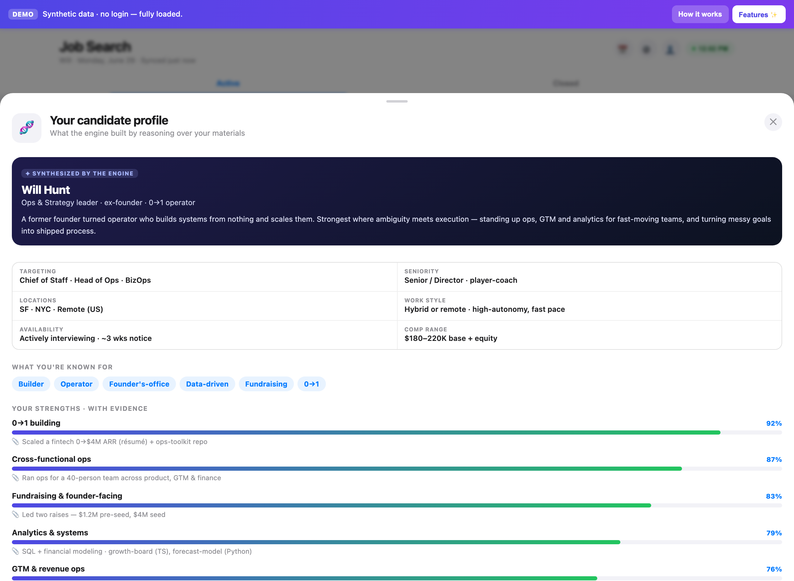
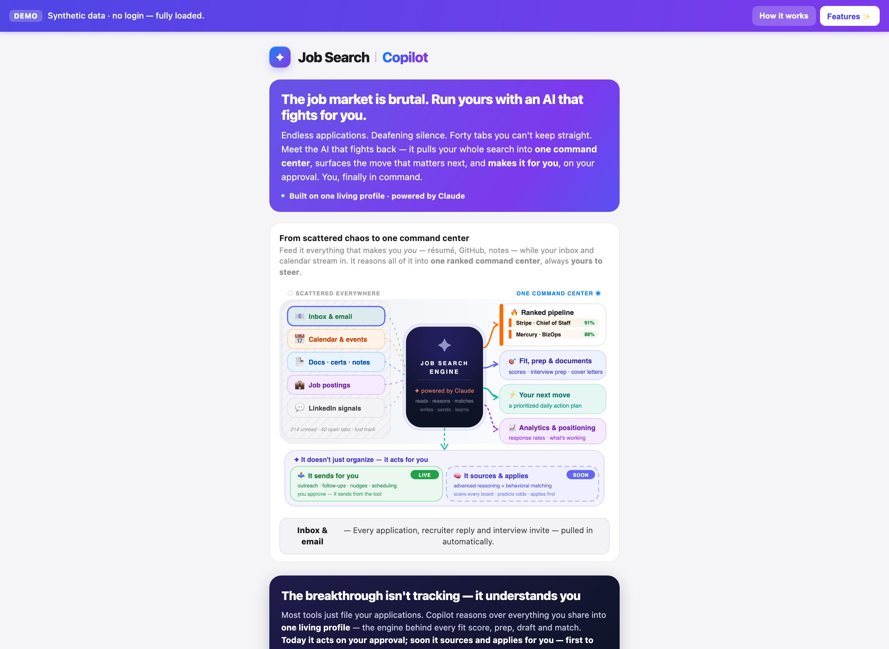
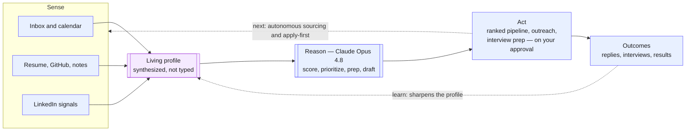

# Job Search Copilot

**It builds a living profile of you, reasons over your entire search with Claude Opus 4.8, and surfaces the one move that matters today — then makes it for you, on your approval.**

 

### ▶︎ Try the live demo

**https://job-search-demozip--hashemselsherif.replit.app**

 

---

## The problem

Job hunting is a data problem wearing a willpower costume.

The signal that actually decides your search is real and knowable — who replied, which interview is Tuesday, where you're genuinely strong, what to send before the day ends. But it's shattered across an inbox, a calendar, a résumé, a GitHub, a LinkedIn feed, and a dozen open tabs. No one can hold all of it in their head, so the search runs on adrenaline: you chase the loudest thread instead of the most important one, and the best move of the day quietly never happens.

The answer isn't one more tracker to keep current by hand. It's a system that holds the whole picture for you, **thinks about it continuously**, and hands you the next move.

> This repository is a **public showcase** — a live demo, screenshots, and how it's built. The implementation source is kept private.

---

## The idea: one profile, one loop

At the center of Job Search Copilot sits a single **living profile** — not a form you fill out, but a model of you the engine *synthesizes* from your raw materials: your résumé, your projects, your notes, even the way recruiters actually write to you.

Everything else orbits that profile in a loop:

> ### **Sense → Reason → Act → Learn → _a sharper profile_ → repeat**

- **Sense** — it reads your inbox, calendar, and LinkedIn signals and folds them into one ranked board.
- **Reason** — **Claude Opus 4.8** scores every opportunity against your profile, argues the fit, and decides what's urgent.
- **Act** — it drafts the outreach, preps the interview, and surfaces the single highest-leverage move — then executes on your approval.
- **Learn** — every reply, interview, and outcome flows back in, and the profile gets sharper.

That last arrow is the whole product. Most tools give you a snapshot. This one is a **flywheel** — and the reasoning loop is what spins it.

---

## The flywheel — it compounds

 
<em>The profile is <strong>synthesized by the engine</strong> from your materials — strengths backed by evidence, not self-reported.</em>

 

The first thing the engine ever does is **build the profile**. Point it at your résumé, GitHub, and notes, and Opus 4.8 reasons out a structured picture of you: your strengths *and the evidence behind each one*, your real target roles, your differentiators, the gaps worth managing. Not keywords scraped off a page — an argument for who you are and where you'll win.

From there, the flywheel turns. The more you feed the profile, the better **everything downstream gets at once**:

- Add your GitHub → fit scores get more honest.
- Drop in past cover letters → drafts start sounding like *you*.
- Connect your inbox → prioritization stops guessing and starts knowing.

A form gives you the same value on day 100 as on day 1. A flywheel gives you more every turn. The effort is front-loaded; the payoff compounds.

---

## What it does today

Everything below is live in the demo right now — five facets of the same loop, all reading from the one profile at its center.

### 1 · Profile synthesis — the heart
The engine reads your materials and **reasons out a living candidate profile**: evidence-backed strengths, target roles, differentiators, and honest gaps. Built once by reasoning, refined continuously by everything that happens next. This is the asset every other feature draws on.

### 2 · Command-center aggregation
Scattered signal becomes one ranked board — recruiter threads, interview invites, follow-ups, job postings, and LinkedIn outreach, all slotted automatically into who's **interviewing**, **networking**, **applied**, and **new leads**, each with a fit score and the *next step that matters*.

### 3 · Fit scoring & classification
Opus 4.8 reads each opportunity against your profile and assigns a **fit score with its reasoning** — not a keyword match, but an argument for *why* a role fits, where you're strong, and where the gaps are. Every thread is auto-classified into a pipeline stage, so nothing rots in your inbox.

### 4 · Analytics & positioning
LinkedIn reach, response rates, and momentum tracked over time — so the search is **measured, not guessed**, and the profile keeps learning from how the market actually responds to you.

### 5 · Execution — it acts, you approve
This is the part that isn't just a tracker. The copilot **drafts and sends** outreach, follow-ups, nudges, and scheduling notes, preps you for interviews, and surfaces the **single highest-leverage move** each day. **You approve, it delivers** — nothing leaves without you.

---

## The reasoning layer

Claude is the engine, not a chatbot bolted on the side. And the work that decides outcomes runs on the model that reasons best.

The highest-stakes calls — **profile synthesis, fit analysis, interview prep, the daily insight, and every word it writes in your voice** — run on **Claude Opus 4.8**, Anthropic's most capable model, at its highest reasoning effort. High-volume classification and factual lookups route to lighter, faster models. Quality is spent where judgment *is* the product, and nowhere it isn't.

| Stage of the loop | What Claude does | Model |
| --- | --- | --- |
| **Synthesize** | Turn raw materials into the living profile | **Opus 4.8** |
| **Score** | Argue each role's fit, with evidence and gaps | **Opus 4.8** |
| **Prepare** | Interview prep, the daily highest-leverage move | **Opus 4.8** |
| **Draft** | Outreach, follow-ups, nudges, cover letters in your voice | **Opus 4.8** |
| **Classify** | Sort every inbox/calendar item into the right stage | Haiku |
| **Extract** | Pull facts from job descriptions and digests | Sonnet |

Architecturally, every call routes through a **central proxy** — a zero-dependency Node server holding the API key — so end users never need their own key or credits, behind a **graceful fallback chain** (host → server proxy → user key → offline demo) so the app degrades instead of breaking. The routing is mapped in [`docs/diagrams/model-routing.svg`](docs/diagrams/model-routing.svg); the backend is documented in [`docs/BACKEND.md`](docs/BACKEND.md).

---

## Closing the loop

Today the copilot closes most of the loop — it senses, reasons, acts, and learns — but **you** still go find the roles. The next phase closes it the rest of the way: the engine sources the front of the funnel for you, and the flywheel runs end to end with you in the approval seat, not the data-entry seat.

- **🔭 Sourcing & matching engine** — continuously scans every job board, matches roles against your living profile with deep reasoning and behavioral signals, **predicts your odds**, and surfaces best-fit roles before you ever go looking.
- **🤖 Apply-first automation** — drafts the tailored application and **applies first**, on your approval, so your time goes to conversations instead of forms.
- **🔐 Zero-setup access** — server-side Google OAuth, so a user just "Signs in with Google" — no per-user API keys or cloud setup.
- **📈 Outcome learning** — interview results feed back into the profile, so scoring and targeting sharpen with every cycle.

_The solid path runs today. The dotted arrows are the loop closing — outcomes feeding the profile, and the engine sourcing for you._

---

## Engineering notes

- **Single-file front end** — the entire app is one self-contained, dependency-free HTML/JS file; the live demo runs with zero backend by mocking the AI and connector layer.
- **Three-tier reasoning router** — a zero-dependency Node proxy routes each call to the right model (Opus 4.8 for reasoning and generation, Sonnet for extraction, Haiku for classification), with per-IP rate limiting and a capability-probe (`/api/health`) the front end uses to discover which models are live.
- **Sanitizing build pipeline** — a build step regenerates the public demo from the real connected app, swapping in synthetic data and stripping every personal identifier at build time, so the shareable artifact is provably free of private data.
- **Accessible & responsive** — keyboard focus states, reduced-motion support, and a layout that goes from a mobile column to a desktop command board.

---

### Try it for yourself

**https://job-search-demozip--hashemselsherif.replit.app**

 

Built by **Hashem Elsherif** · © 2026 · Showcase repository — implementation source kept private.

