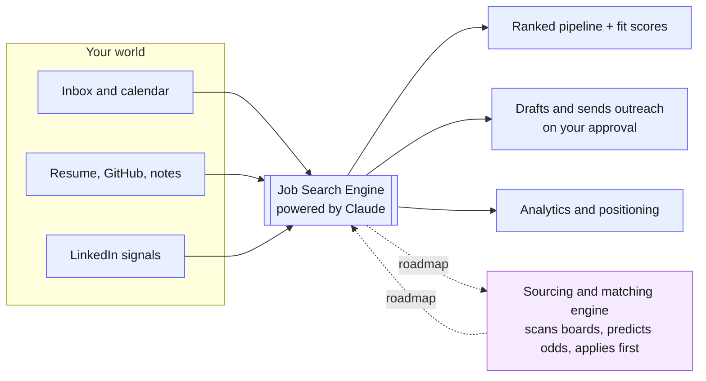

# Job Search Copilot

**An AI command center for the job hunt — it aggregates your entire search, reasons over it with Claude, and acts on your behalf.**

 

### ▶︎ Try the live demo

**https://job-search-demozip--hashemselsherif.replit.app**

 

---

## The idea

Job hunting is a data problem wearing a willpower costume. The signal — who replied, which interview is next, where you're strong, what to send today — is scattered across an inbox, a calendar, a résumé, a dozen tabs, and LinkedIn. Job Search Copilot pulls all of it into **one ranked command center**, has **Claude reason over the whole picture**, and then **does the next move for you** — on your approval.

This repository is a **public showcase** of the product: a live demo, screenshots, and an overview of how it's built. The implementation source is kept private.

---

## What it does today

Everything below is live in the demo right now.

### 1 · Command-center aggregation
Pulls scattered signal into a single, ranked pipeline:
- **Inbox & calendar** — recruiter threads, interview invites, and follow-ups are read and slotted automatically.
- **Your materials** — résumé, GitHub, and notes become a reusable profile.
- **Job postings & LinkedIn signals** — roles and outreach folded into the same board.

The result is one view: who's **interviewing**, **networking**, **applied**, and **new leads** — each with a fit score and the *next step that matters*.

### 2 · AI fit scoring & classification
Claude reads each opportunity against your profile and assigns a **fit score with reasoning** — not a keyword match, but an argument for *why* a role fits, where you're strong, and where the gaps are. Every thread is auto-classified into a pipeline stage so nothing rots in your inbox.

### 3 · Analytics & positioning
LinkedIn reach, response rates, and momentum tracked over time — so the search is measured, not guessed.

### 4 · Execution — it acts, you approve
This is the part that isn't just a tracker. The copilot **drafts and sends** outreach, follow-ups, nudges, and scheduling notes straight from the tool. It surfaces the **single highest-leverage move** each day and prepares it. **You approve, it delivers** — nothing is sent without you.

---

## How AI is leveraged

Claude is the reasoning engine, not a chatbot bolted on the side. It is used to:

| Job | What Claude does |
| --- | --- |
| **Classify** | Sort every inbox/calendar item into the right pipeline stage |
| **Score** | Argue each role's fit against your profile, with evidence and gaps |
| **Synthesize** | Turn your raw materials into a structured candidate profile |
| **Draft** | Write outreach, follow-ups, nudges, and cover letters in your voice |
| **Prioritize** | Decide the one move that matters most today and prep it |

Architecturally, AI calls route through a **central proxy** (a zero-dependency Node server holding the API key) so end users never need their own key or credits, with a **graceful fallback chain** — host → server proxy → user key → offline demo — so the app degrades instead of breaking.

---

## The flywheel — it gets sharper the more you feed it

There is **one living profile** at the center of the product. Feed it your résumé, GitHub, notes, and inbox, and every downstream output gets better: fit scores get more accurate, drafts sound more like you, prioritization gets smarter. The tool's usefulness compounds with what you give it — the opposite of a form you fill out once.

 
<em>The profile is <strong>synthesized by the engine</strong> from your materials — strengths backed by evidence, not self-reported.</em>

---

## Where it's going — closing the full loop

Today the copilot is the command center for a search **you** still source. The next phase makes it **autonomous on the front end of the funnel**, closing the loop end to end:

- **🔭 Sourcing & matching engine** — continuously scans every job board, matches roles against your living profile with advanced reasoning + behavioral signals, **predicts your odds**, and surfaces the best-fit roles before you ever go looking.
- **🤖 Apply-first automation** — drafts the tailored application and **applies first**, on your approval, so you spend time on conversations instead of forms.
- **🔐 Zero-setup access** — server-side Google OAuth so a user just "Signs in with Google" — no per-user API keys or cloud setup.
- **📈 Outcome learning** — feed interview outcomes back in so scoring and targeting sharpen with every cycle.

_Solid = shipping today · dashed = roadmap._

---

## Engineering notes

- **Single-file front end** — the entire app is one self-contained, dependency-free HTML/JS file; the live demo runs with zero backend by mocking the AI and connector layer.
- **Zero-dependency Node proxy** — central AI gateway with per-IP rate limiting and a capability-probe (`/api/health`) the front end uses to discover whether central AI is available.
- **Sanitizing build pipeline** — a build step regenerates the public demo from the real connected app, swapping in synthetic data and stripping every personal identifier at build time, so the shareable artifact is provably free of private data.
- **Accessible & responsive** — keyboard focus states, reduced-motion support, and a layout that goes from a mobile column to a desktop command board.

---

### Try it for yourself

**https://job-search-demozip--hashemselsherif.replit.app**

 

Built by **Hashem Elsherif** · © 2026 · Showcase repository — implementation source kept private.

